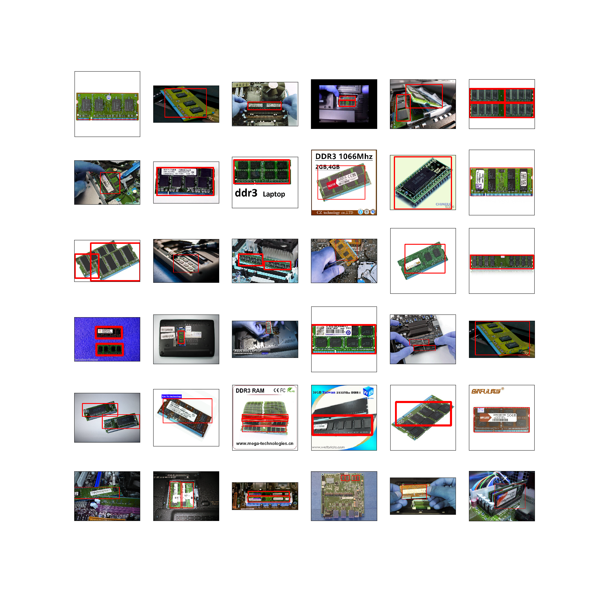

I've been trying to train an object detection model to detect parts of a PC when looking at it. The idea is to constantly monitor this and keep track of part removal, replacement etc. There are many ways to do this, but I have some limitations as well, I strictly want to be able to do everything from python and I want to be able to train my model using the local CPU cluster I have available. After some research on different ways of doing this and the various frameworks and algorithms out there, I came across what might be my best shot; [TensorFlow Object Detection API](https://github.com/tensorflow/models/tree/master/research/object_detection). This comes with a really good set of tutorials that I followed. However, before getting to the point to use this API, I needed to make some labeled data. My googling around, concluded that there is no easy way of doing it. There are only semi-automated software to do the labeling but all of them consist some few hours of manual labor for the smallest dataset required to train a single-class model, and if it becomes anything more than a prototype or a personal fun project, outsourcing is always as option! So let's start by how I did it for this project.

### Collect and annotate training data

1- Scrape the web for images of interesting parts/pieces in as many light conditions and from as many angles as possible (especially including in an assembled machine) - I did this by hand, and for a single PC part only. Since I am only making a prototype project and testing if it is going to work at all!

2- Annotate the images with the tool of choice. I used [ImageNet-Utils](https://github.com/tzutalin/ImageNet_Utils). It's simple and fast and easily gives you XML annotations in the pascal VOC format (In fact, it can also output the bbox coordinates in txt files suitable for darknet as well, but I have not used it). It is, however, missing a magic wand tool for object selection.
  * some of the other tools I found interesting along the way:
    - [VGG](http://www.robots.ox.ac.uk/~vgg/software/via/)
    - [LabelD](https://sweppner.github.io/labeld/)
    - [Sloth](https://cvhci.anthropomatik.kit.edu/~baeuml/projects/a-universal-labeling-tool-for-computer-vision-sloth/)
    - [Annotorious](http://annotorious.github.io/)
  * In real life we might want to spend some money and outsource it using , for example, [LabelMe](http://labelme2.csail.mit.edu/Release3.0/browserTools/php/mechanical_turk.php)

Here is a collection of images I used with the boxes.

I probably should have been more consistent in drawing the boxes for images with perspective, but this was something I thought of after having labeled more than half of my photos, so I didn't go back to fix anything!

A couple hours later, I have a dataset of ~130 annotated photo and can move on to the more fun part.

In fact, I found the data labeling step so tedious and inefficient that I ended up writing [a little object tracker](https://asadisaghar.github.io/video-labeler/) to do the job for me.

### Train the model

Tensorflow - like all other object detection frame works - has come up with its own -binary- format for annotation/labels. Fortunately, there is a [tutorial](https://github.com/tensorflow/models/blob/master/research/object_detection/g3doc/preparing_inputs.md) on how to make these records from two common annotation formats. Since I got to know about the tf object detection API by [this blog post](https://medium.com/towards-data-science/how-to-train-your-own-object-detector-with-tensorflows-object-detector-api-bec72ecfe1d9) to begin with, I used some of his tools as well.

My labeling tool at this point was giving me XML annotations in the COCO format, which are converted into a csv file containing the list of images and the bounding boxes and labels of the objects inside the image. In this step, I am only including positive labeling of the data, so as you will see in the end of this post, the model ends up having too many false positives, which I will deal with later.

This list needs to be divided into a training set and test/validation set. Since there was no order to my labeled images, I did this by random and chose ~20 images out of my ~130 to use as a test set, never seen by the model during the training. These csv files are then translated into tfrecords.

Now we need to configure the model and whether to use a pre-trained checkpoint, and what. There is a [list of pre-trained models](https://github.com/tensorflow/models/blob/master/research/object_detection/g3doc/detection_model_zoo.md) that is suggested to use depending on what _feature extractor_ is used in the config file. I chose to use __ssd_mobilenet_v1_coco__ as I cared about how fast I can see some results (event less robust ones) more than anything else. But this is definitely something to explore once I'm done confirming that this pipeline as a whole is a good choice for my purpose.

The only obstacle I faced in using a pre-trained checkpoint was that I tried to mix and match the feature extractor and checkpoint. Beside, I wasn't sure how to indicate which one of the "model.ckpt.*" files I needed to use in my config file. The answer, if you are curious, is to use exactly "model.ckpt" which will automatically include the meta data and the specific epoch weights.

I trained the model on my local machine, and even though the loss drop down to ~3 in about 1000 epochs already, the rest of my [overnight] training (for another 6k epochs or so) didn't manage to improve the loss by much.

### Evaluate the performance

Now that we have a trained checkpoint, let's see how well the model has learned to detect memory modules in a PC.

It doesn't look that bad. Although there is so much room for improvement. The model has picked uop the shape and form of a RAM module, but since it has never seen any negatively-labeled images, it detects the text box similar to those on the label of one of the training images as a RAM module too, or the motherboard labeled ram. So, the next step would be to feed more, better-labeled data to the same chack point and include some false images as well. I believe this is only a problem with single-class object detection though...

### A concise to-do list:

Follow the updates on the following to-do list and relevant scripts [here](https://github.com/innovationgarage/train-tf-object-detection)

## 1. Label images 

  - If you are using a pre-labeled dataset, you may have to jump forward to one of the steps between 2 to 6 depending on the format of the labels

  - Follow these steps to make [ImageNet-Utils](https://github.com/tzutalin/ImageNet_Utils)
  
        git clone --recursive https://github.com/tzutalin/ImageNet_Utils.git  
        mkvirtualenv Imagenet_utils
        workon Imagenet_utils
        sudo apt-get install pyqt4-dev-tools
        pip install Pillow
        cd ImageNet_Utils/labelImgGUI
        make all
    
  - Now run the labeling tool
  
        ./labelImg.py
    
  - Labels will be by default saved in the same directory as images. This could be set differently when saving each label but I forgot to do that. So I had to clean up afterwards.
  
        mkdir labels
        mv images/*.xml labels/
  
## 2. Change the format of labels
  
  - Now run the script below from the root directory to make a list of all bboxes. The list will be written to __labels/all_labels.csv__
  
        python xml2csv.py
         
## 3. Check [some of the ] bboxes

  - Install the required libraries
  
        pip install opencv-contrib-python
        pip install matplotlib
      
  - Run the following script to check the labeling you did. The output will be saved in __training_data.png__ 
  
        python draw_training_data.py

## 4. Split training/validation sets

  - Run the following commands to make __data/train_label.csv__ and __data/test_label.csv__ using the test fraction as the argument to the split function.
  
        mkdir data
        python split_train_valid.py 0.05
     
## 5. Generate TFRecords for training/validation sets

  - At this stage we need to use the tensorflow object detection, so I copy the entire directory to my project directory and then the images, labels and data to __tensorflow/models__
  
        mkdir tensorflow
        cd tensorflow
        mkdir models
        cd models
        rsync -r --progress ~/tf-models/research/object_detection/ object_detection/
        mv ../../generate_tfrecord.py .
        rsync -r --progress ../../images/ Images/
        rsync -r --progress ../../data/ data/
       
  - I have a separate virtualenv for tf object detection, so I switch to work in that environment from now on
  
        workon tf-objectdetection
        
  - Make sure yo introduce the map for your labels, before generating TFRecords from the csv file. The format of this map simply needs to be as below for each class:

        item {
          id: 1
          name: 'class label'
        }
        
  - As of now, you also need to modify function __class_text_to_int__ in __generate_tfrecord.py__ to match the class name as well.        

  - Then run the following for  __train_label.csv__ and __test_label.csv__ to convert them to TFrecords (the format TF expects to read image labels)
  
        python generate_tfrecord.py --csv_input=data/train_labels.csv  --output_path=data/train.record
        python generate_tfrecord.py --csv_input=data/test_labels.csv  --output_path=data/test.record
        
## 6. Configure the network and choose a checkpoint to use

  - Find the config file you find best fitting to your problem or use the one included in thie repository. I am running my training locally and therefore I need to set the path to traininig/validation records, as well as the model checkpoint (let's say __ssd_mobilenet_v1_coco__). if you use my config file search for the term __PATH_TO_BE_CONFIGURED__ and set the paths. Also make sure to set the correct value to __num_classes__!
  
## 7. Train

  - Run the following line and make sure to pass the correct arguments

        python object_detection/train.py \
            --logtostderr \
            --pipeline_config_path=./ssd_mobilenet_v1_coco.config \
            --train_dir=./model/train/

      
## 8. Validate

  - Run this in a separate window (make sure to change to the correct virtualenv first)
  
        python object_detection/eval.py \
            --logtostderr \
            --pipeline_config_path=./ssd_mobilenet_v1_coco.config \
            --checkpoint_dir=./model/train/ \
            --eval_dir=/model/valid/
        
## 9. Check the progress

  - Now let's run a tensorboard instance to check the progress for both training and validation sets.
  
        tensorboard --logdir=./model/
        
## 10. Export the trained model

  - Once training is finished, you may want to export the latest checkpoint of your model (or any checkpoint for that matter) to a model and use it for a later training as the base.
  
        python object_detection/export_inference_graph.py \
            --input_type image_tensor \
            --pipeline_config_path=./ssd_mobilenet_v1_coco.config \
            --trained_checkpoint_prefix ./model/train/model.ckpt-[EPOCH NO] \
            --output_directory .checkpoitns/saved_model_[EPOCH NO].pb
      
