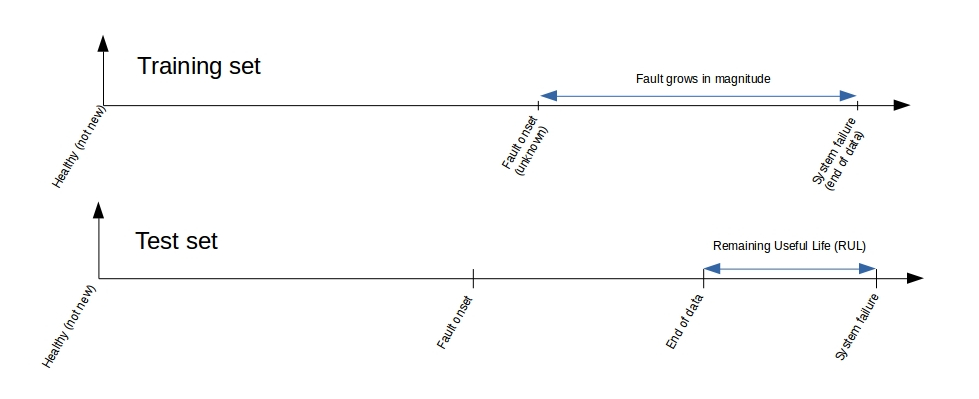
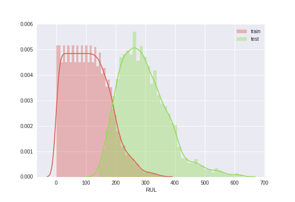
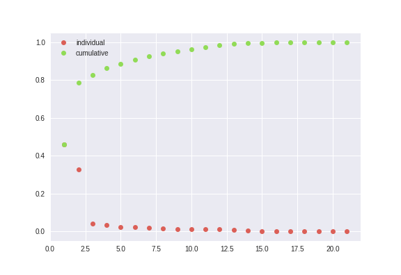
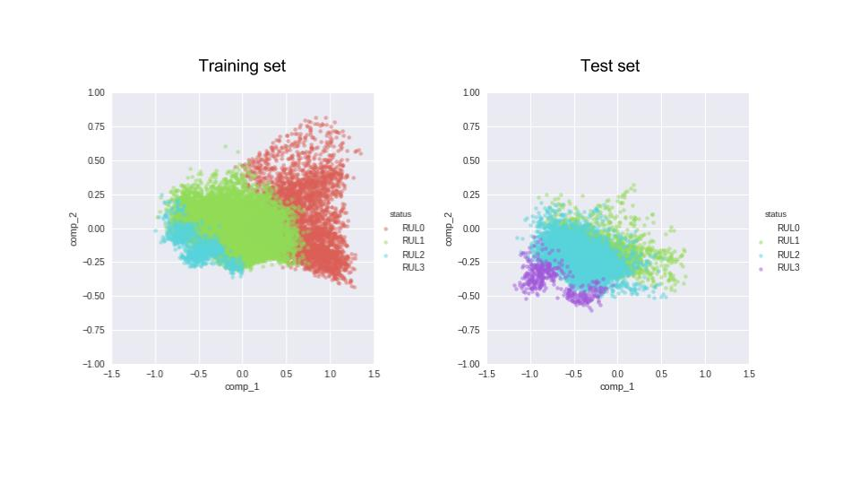
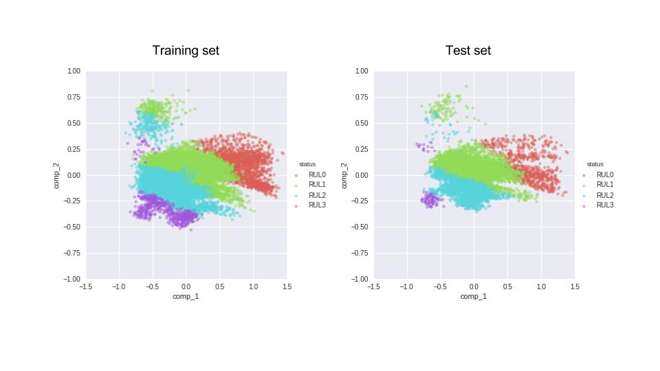

Lately, I've gotten interested in predictive maintenance and wonder how close are we in replacing preventive maintenance with predictive models. The more I read/thought about it the more I realized how much the answer hinges on the practice of keeping record of all piece replacements and maintenance, and engineering logs etc. and the whole thing became more and more overwhelming... Until I came across [this](https://ti.arc.nasa.gov/tech/dash/pcoe/prognostic-data-repository/#turbofan) -admittedly over simplified- set of -simulated- data and decided to start playing with it. The details of the simulations and some contextual information about the data are explained in a [paper](https://www.google.no/url?sa=t&rct=j&q=&esrc=s&source=web&cd=1&ved=0ahUKEwis05bV4LHWAhWKfRoKHZabAakQFggoMAA&url=https%3A%2F%2Fti.arc.nasa.gov%2Fpublications%2F154%2Fdownload%2F&usg=AFQjCNELnrsSWOvSTQlF39WXmZ9cF9ka5g) that I have only browsed very briefly and even now, have no idea what each of the columns I've worked with mean, but in a way this is part of the fun too.

### About CMAPSS dataset

According to the README that comes with the dataset, the format of training and test sequences (for each engine with a separate id) looks like the schematics bellow. This also implies that we have more observations of systems that are critically close to their failure than those farther away from it. This could be our curse or blessing, depending on what we are interested in. If we are interested in spotting a failing system as soon as possible (but possibly with a larger margine of accuracy), this is not how we want our training and test set to  look like. However, if we are interested in learning the exact beahviour of the system after the first fault and the growth of the system failure, we could embrace this training set. Although the test set then may not be perfect for us. This will get clearer if we look at the actual distribution of RUL values (in cycle) for the training and test sets.

This relationship between lables of the training and test set looks a bit troublesome, how could we expect our model that is trained on the red plot, return reliable prediction of system on the green?

### Regression or Classification

This brought me to the question of method, should I solve this as a regression problem, learn from the sequences my training data provides me with, and predict a value for the RUL together with the uncertainties, or should I try to learn/predict the health stage the engine is in, at each point in time? The former method is probably something to try on solving using a seq2seq method like an LSTM (or stacking a bunch of them), but for now I'm sticking to the classification approach.

### Preprocessing
Like every other dataset, I started by just looking at my columns and their different statistical description/aggregation etc. to get an idea of what's going on. This step is -obviously- quite experimental, but here is a bullet-point description of it that I found usefull to document and look at everytime I go back to o the same thing for new subsets of the data.

- Evaluate RULs from assumptions about the training set and label files for the test set
- Scale all features and labels
- Bin labels(RULs) into discrete classes
- Binary and one-hot encode labels (moved to the classification notebooks for clarity)
- PCA (since the EDA and a crude physical understanding of the system was telling me that most of these columns are probably very weakly related to what I'm interested in learning about the system - and I was right)

After examining the results of the PCA (and trying a few unsupervised classification on the data, that failed miserably), I decided to merge the provided training and test sets, so that my algorithm gets a chance to learn about all stages of an engine's health before it has to predict the classes. This is the separation of our 4 classes based on the labels (RULs) for the training and test set. The training set has no instances of RUL but lots of RUL0, while the test set is the opposite (RUL0 corresponds to the last healthy phase of the engine where the RUL is very small, and RUL3 corresponds to the leftmost part of the sequences in figure 1).

Now let's merge the datasets (and then split them randomly into training, test, and validation sets). So, when it comes to predicting the health stage of the engine, the training algorithm is actually aware of all the n (in this case 4) classe that we have defined.

Next I save the preprocessed data and form now on work with the principal components as my features only.

- [Preprocessing notebook](https://github.com/asadisaghar/PdM-C-MAPSST/blob/master/play/publish/preprocessing.ipynb)

### Supervised vs. unsupervised
I first started 
- [Unsupervised classification notebook](https://github.com/asadisaghar/PdM-C-MAPSST/blob/master/play/publish/unsupervised_classification.ipynb)
- [Supervised classification notebook](https://github.com/asadisaghar/PdM-C-MAPSST/blob/master/play/publish/supervised_classification.ipynb) including KNN, a shallow fully-connected feed forward network, and a shallow hour-glass architecture (because it's fun!)
- [LSTM classification](https://github.com/asadisaghar/PdM-C-MAPSST/blob/master/play/publish/LSTM_classification.ipynb) probably a bit over-kill for this particular dataset but fun to play with anyway.
